# Software Requirements Specification (SRS)
# FOTON Unit Monitoring System

**Versi:** 2.0  
**Tanggal:** 2026-03-15  
**Status:** Draft

---

## 1. Pendahuluan

Dokumen ini mendefinisikan persyaratan arsitektur, fungsionalitas, keamanan, dan hak akses (*Roles*) untuk pembangunan ulang aplikasi **FOTON Unit Monitoring System**. Aplikasi ini akan bertransisi dari tumpukan (stack) *Frontend React + Base44 Cloud* menuju arsitektur berdaulat mandiri menggunakan kerangka **PHP Laravel (Monolitik)** dengan *database* **MySQL Lokal**.

---

## 2. Arsitektur Sistem (Technical Stack)

Aplikasi didesain secara Monolitik (*Monolith*) di mana Lapis *Backend* dan *Frontend* digabungkan ke dalam satu wadah *project* untuk memudahkan *deployment* di server kantor.

| Layer | Teknologi |
|-------|-----------|
| **Frontend (UI)** | React.js + Tailwind CSS + shadcn/ui |
| **Adapter** | Inertia.js (menghubungkan React ke Laravel tanpa REST API terpisah) |
| **Backend** | PHP v8.x + Laravel v11.x (Router, Controller, Eloquent ORM) |
| **Auth** | Sesi PHP Laravel + UUID sebagai session identifier (mencegah IDOR) |
| **Database** | MySQL v8.x dengan fitur `JSON Column` untuk spesifikasi dinamis |
| **Real-time** | Polling setiap 5 detik via React Query, siap upgrade ke Laravel Reverb WebSocket |

---

## 3. Sistem Role & Hierarki Akses

### 3.1 Prinsip Dasar

Aplikasi menggunakan **Role-Based Access Control (RBAC)** dengan prinsip:

1. **Field Team** hanya bisa mengerjakan tugasnya sesuai state yang ditugaskan — tidak bisa kelola akun apapun
2. **Sales** mengelola field team di phase/state mereka + dashboard phase 1 & 4
3. **After Sales** mengelola field team di phase/state mereka + dashboard phase 2 & 3 (state 4-7)
4. **COO** adalah God Mode — akses penuh ke semua dashboard dan kelola akun Sales & After Sales

> **Tidak ada role "admin"** dalam sistem ini. Fungsi administratif didelegasikan sesuai hierarki di atas.

---

### 3.2 Hierarki Lengkap

```
COO  (God Mode — akses menyeluruh)
│
├── SALES
│   ├── Kelola akun: Forwarder, Gudang, Ekspedisi, Driver, PIC Sales
│   └── Dashboard: monitor unit State 1–3 dan State 8–11
│       ├── Forwarder   → State 1, 2, 3
│       ├── Gudang      → State 8, 9
│       └── Ekspedisi / Driver → State 10, 11
│
└── AFTER SALES
    ├── Kelola akun: Karoseri, Foreman, PIC After Sales
    └── Dashboard: monitor unit State 4–7
        ├── Karoseri → State 4, 5, 6
        └── Foreman  → State 7 (QC/PDI)
```

### 3.3 Tabel Hak Akses per Role

| Role | Dashboard | Kelola Akun | Update State |
|------|-----------|-------------|--------------|
| `coo` | Semua (Sales + After Sales + Field Team) | Sales, After Sales | Semua state (God Mode) |
| `sales` | State 1–3 & 8–11 | Forwarder, Gudang, Ekspedisi, Driver, PIC Sales | Tidak (observer) |
| `after_sales` | State 4–7 | Karoseri, Foreman, PIC After Sales | Tidak (observer) |
| `forwarder` | — | — | CBU: State 1, 2, 3 |
| `karoseri` | — | — | CBU: State 4, 5, 6 / CKD: State 4, 5, 6 |
| `foreman` | — | — | CBU: State 7 (PDI) / CKD: State 7 (PDI) |
| `gudang` | — | — | CBU: State 8, 9 / CKD: State 8 (Gudang Masuk), State 9 (Gudang Keluar) |
| `ekspedisi` / `driver` | — | — | CBU: State 10, 11 / CKD: State 10 (DO/SELESAI) |
| `na` | — | — | CKD: State 0, 1 |
| `dealer` | — | — | CKD: State 2, 3 |

---

## 4. Sistem Autentikasi & Login

### 4.1 Mekanisme Login (Opsi A — Single Login URL)

Semua pengguna menggunakan **satu halaman login** yang sama:

```
URL: /login  (atau /MobileUpdate untuk field team via link)
```

**Alur Login:**
```
[Pengguna buka halaman login]
        ↓
[Masukkan Kode Akses]
        ↓
[Sistem validasi kode → cek role di tabel access_codes]
        ↓
┌────────────────────────────────────────┐
│ Role?                                   │
├──────────┬──────────┬──────────────────┤
│ coo      │ sales    │ after_sales      │ → Redirect: /dashboard/[role]
├──────────┤          │                  │
│         field team (forwarder, dll)    │ → Redirect: /mobile (halaman update state)
└────────────────────────────────────────┘
```

**Field Team** mendapatkan link langsung dengan kode tersemat:
```
https://[domain]/MobileUpdate?code=XXXXXXXX
```
Link ini di-generate oleh Sales (untuk field team mereka) atau After Sales (untuk field team mereka).

### 4.2 Perlindungan Akun COO

- Akun COO **tidak bisa diubah** oleh Sales atau After Sales
- Hanya COO sendiri yang bisa mengubah kode aksesnya sendiri
- Akun COO dijaga di level aplikasi (middleware check)

### 4.3 Tabel `access_codes`

| Field | Tipe | Keterangan |
|-------|------|------------|
| `id` | UUID (PK) | Primary key |
| `code` | VARCHAR(50) | Kode akses unik |
| `name` | VARCHAR(200) | Nama pengguna |
| `role` | ENUM | Lihat daftar role di §3.3 |
| `phone` | VARCHAR(20) | Nomor WhatsApp |
| `division` | VARCHAR(100) | Divisi (misal: Technical) |
| `location` | VARCHAR(100) | Lokasi/area kerja |
| `is_active` | BOOLEAN | Status aktif |
| `last_access` | DATETIME | Timestamp login terakhir |
| `created_by` | UUID (FK) | ID pembuat akun |

---

## 5. Use Case Diagram

```mermaid
flowchart TD
    %% =================== AKTOR ===================
    FT(["👷 Field Team\n─────────────────\nForwarder\nKaroseri\nForeman\nGudang\nEkspedisi / Driver\nNA / Dealer"])
    SALES(["🔵 Sales"])
    AS(["🟣 After Sales"])
    COO(["🔴 COO\n(God Mode)"])

    %% =================== USE CASES ===================
    subgraph UC_AUTH ["🔐 Autentikasi"]
        LOGIN["Login via Kode Akses"]
        REDIRECT["Auto-Redirect ke Dashboard Sesuai Role"]
    end

    subgraph UC_FIELD ["📱 Field Team — Mobile"]
        SCAN["Scan SIN / Input VIN"]
        UPDATE["Update State Unit"]
        PDI["Isi Form PDI\n(Foreman Only)"]
        TROUBLE_RPT["Lapor Trouble"]
    end

    subgraph UC_SALES ["🔵 Sales Dashboard"]
        S_DASH["Pantau Unit\nCBU: State 1–3 & 8–11\nCKD: State 1–3 & 8–10"]
        S_KPI["Lihat KPI & Progress\nPhase 1 dan Phase 4"]
        S_ACC["Kelola Akun\nField Team (Phase 1 & 4)\n+ PIC Sales"]
        S_LINK["Generate Link Mobile\nUntuk Field Team"]
    end

    subgraph UC_AS ["🟣 After Sales Dashboard"]
        subgraph UC_AS_WO ["A — Workshop Operation"]
            A_DASH["Pantau Unit State 4–7\n(Karoseri & PDI)"]
            A_KPI["KPI Progress Karoseri\n0% / 50% / 100% + PDI"]
            A_ACC["Kelola Akun Karoseri,\nForeman, PIC After Sales"]
            A_LINK["Generate Link Mobile\nUntuk Field Team"]
        end
        subgraph UC_AS_TECH ["B — Technical (HO)"]
            T_RESP["Beri Instruksi / ho_response\n(Semua Trouble CBU State 1–11\n/ CKD State 1–10)"]
            T_SOLVE["Tandai Trouble Selesai\n+ Isi Solusi"]
            T_WA["Kirim WhatsApp\nke Pelapor / Field Team"]
        end
    end

    subgraph UC_COO ["🔴 COO — Dashboard Menyeluruh"]
        C_ALL["Pantau Semua Unit\n(Semua State)"]
        C_SALES_VIEW["Lihat Dashboard Sales"]
        C_AS_VIEW["Lihat Dashboard After Sales"]
        C_ACC["Kelola Akun Sales\n& After Sales"]
        C_GOD["Update State Bebas\n(God Mode — Bypass Semua Aturan)"]
        C_IMPORT["Import & Export\nData Unit (Excel)"]
    end

    subgraph UC_TROUBLE ["⚠️ Trouble — Dilaporkan Field Team"]
        T_NOTIF["Lapor Trouble + Foto\n+ Kronologi + Lokasi"]
        T_LOCK["Unit Terkunci (Trouble Lock)\nTidak Bisa Update State"]
    end

    %% =================== KONEKSI ===================
    FT --> LOGIN
    SALES --> LOGIN
    AS --> LOGIN
    COO --> LOGIN
    LOGIN --> REDIRECT

    FT --> SCAN --> UPDATE
    FT --> PDI
    FT --> T_NOTIF --> T_LOCK

    SALES --> S_DASH
    SALES --> S_KPI
    SALES --> S_ACC
    SALES --> S_LINK

    AS --> A_DASH
    AS --> A_KPI
    AS --> A_ACC
    AS --> A_LINK
    AS --> T_RESP
    AS --> T_SOLVE
    AS --> T_WA

    COO --> C_ALL
    COO --> C_SALES_VIEW
    COO --> C_AS_VIEW
    COO --> C_ACC
    COO --> C_GOD
    COO --> C_IMPORT
    COO --> T_RESP
    COO --> T_SOLVE
```



---

## 6. Alur Progres Unit (State Pipeline)

### 6.1 Alur CBU (Completely Built-Up) — 11 States

Setiap update state dilakukan dengan **Scan SIN** (Stiker Identifikasi Kendaraan yang ditempel saat unit tiba di Priok).

```
State 0 → State 1 → State 2 → State 3 → [State 4 → 5 → 6 → 7] → State 8 → State 9 → State 10 → State 11
  Priok    Forwarder  Forwarder  Forwarder   ←── After Sales ───→   ←─── Sales ───→   Ekspedisi  SELESAI
                                             Karoseri  Karoseri QC  Gudang   Gudang
                                              0%→100%   PDI         Masuk    Keluar
```

| State | Nama | Role yang Aksi | Foto Wajib | Dashboard |
|-------|------|----------------|------------|-----------|
| 0 | Di Priok (belum keluar) | — | — | Sales (monitor) |
| 1 | Keluar Pabrik/Priok | `forwarder` | ✅ | Sales |
| 2 | Foto Tiba di Karoseri | `forwarder` | ✅ | Sales |
| 3 | Tiba di Karoseri | `forwarder` | ✅ | Sales |
| 4 | Karoseri 0% | `karoseri` | ✅ | After Sales |
| 5 | Karoseri 50% | `karoseri` | ✅ | After Sales |
| 6 | Karoseri 100% | `karoseri` | ✅ | After Sales |
| 7 | QC / PDI | `foreman` | ✅ | After Sales |
| 8 | Gudang Masuk | `gudang` | ✅ | Sales |
| 9 | Gudang Keluar | `gudang` | ✅ | Sales |
| 10 | Keluar ke Customer | `ekspedisi`, `driver` | ✅ | Sales |
| 11 | SELESAI | `ekspedisi`, `driver` | ✅ + Alamat | Sales |

**Catatan State 0 (Di Priok):**
Sebelum State 1, unit sudah ada di sistem (diimport via Excel) tapi belum dikonfirmasi keluar. Aktivitas di Priok:
- Buka kontainer
- General Inspection (GI)
- Penempelan Stiker SIN (Stiker Identifikasi Kendaraan)

### 6.2 Alur CKD (Completely Knocked-Down) — 11 States

```
State 0 → State 1 → State 2 → State 3 → [State 4 → 5 → 6 → 7] → State 8  → State 9  → State 10
  NA       NA/PDI    Keluar     Keluar    ←── After Sales ───→    Gudang      Gudang      DO
           QC        ke Dealer  ke Karoseri  Karoseri 0-100% PDI  Masuk       Keluar    SELESAI
```

> **Catatan Alur:** Setelah State 7 (PDI), unit **wajib** melalui State 8 (Gudang Masuk) → State 9 (Gudang Keluar) → baru bisa ke State 10 (DO). Pola ini **sama persis dengan CBU** untuk memastikan semua pergerakan unit tercatat.

| State | Nama | Role yang Aksi | Foto Wajib | Dashboard |
|-------|------|----------------|------------|-----------|
| 0 | PDI di NA | `na` | ✅ | After Sales |
| 1 | Keluar ke Dealer | `na`, `dealer` | ✅ | Sales |
| 2 | Dealer | `dealer` | ✅ | Sales |
| 3 | Keluar ke Karoseri | `dealer`, `karoseri` | ✅ | Sales |
| 4 | Karoseri 0% | `karoseri` | ✅ | After Sales |
| 5 | Karoseri 50% | `karoseri` | ✅ | After Sales |
| 6 | Karoseri 100% | `karoseri` | ✅ | After Sales |
| 7 | QC / PDI | `foreman` | ✅ | After Sales |
| 8 | Gudang Masuk | `gudang` | ✅ | Sales |
| 9 | Gudang Keluar | `gudang` | ✅ | Sales |
| 10 | DO / Keluar ke Customer (SELESAI) | `ekspedisi`, `driver` | ✅ + Alamat | Sales |

### 6.3 Aturan State (Sistem Tongkat Estafet)

1. **Estafet Sequential** — Role hanya bisa update ke state berikutnya dari posisi saat ini. Tidak bisa loncat state.
2. **Trouble Lock** — Jika unit memiliki trouble berstatus `open` atau `waiting_ho`, tombol update **dikunci**. Unit harus menyelesaikan trouble dahulu.
3. **PDI Fork:**
   - ✅ PDI Good → state lanjut normal
   - ❌ PDI Not Good → wajib buat laporan Trouble, state tidak bisa maju
4. **State 11 CBU / State 10 CKD (SELESAI)** — Wajib mengisi: Foto Dashboard + Alamat (Provinsi, Kota, Alamat Lengkap) + Foto Surat Terima Unit (BAST)
5. **CKD: Gudang Wajib (2 Tahap)** — Setelah State 7 (PDI), unit CKD **wajib** melewati State 8 (Gudang Masuk) dan State 9 (Gudang Keluar) sebelum DO. `ekspedisi`/`driver` tidak bisa ke State 10 sebelum `gudang` mengkonfirmasi State 8 & 9. Pola ini identik dengan CBU (State 8 & 9 CBU).

---

## 7. Dashboard Spesifikasi

### 7.1 Dashboard Sales

**Akses:** Role `sales` dan `coo`

**Konten:**
| Komponen | Deskripsi |
|----------|-----------|
| KPI Cards | Total unit di phase Sales (State 1-3 & 8-11), completed, trouble |
| Flow Overview | Visualisasi jumlah unit per-state di Phase 1 & 4 |
| Unit Table | Tabel unit dengan filter state, search VIN |
| Detail Unit | Lihat info lengkap unit termasuk technical specs |
| History | Riwayat update state per unit |
| Trouble Snapshot | Trouble aktif di unit-unit fase Sales |
| Manajemen Akun | Buat/edit/nonaktifkan akun: Forwarder, Gudang, Ekspedisi, Driver, PIC Sales |
| Generate Link | Buat link mobile untuk field team |

**Filter State yang tampil:**
- CBU: State 1, 2, 3, 8, 9, 10, 11
- CKD: State 1, 2, 3, 8, 9, 10

---

### 7.2 Dashboard After Sales

**Akses:** Role `after_sales` dan `coo`

Dashboard After Sales terbagi menjadi **2 divisi utama:**

#### A — Workshop Operation

Menangani operasional proses fisik unit di karoseri dan PDI.

| Komponen | Deskripsi |
|----------|-----------|
| KPI Cards | Total unit di State 4–7, PDI status (passed/failed/pending) |
| Flow Overview | Visualisasi progress karoseri: 0% → 50% → 100% → PDI |
| Karoseri Panel | Unit per karoseri + progress pengerjaan + aging alert |
| Unit Table | Tabel unit dengan filter state, karoseri, progress |
| PDI Summary | Ringkasan hasil PDI: passed/failed/pending per unit |
| Manajemen Akun | Buat/edit/nonaktifkan akun: `karoseri`, `foreman`, PIC After Sales |
| Generate Link | Buat link mobile untuk Karoseri & Foreman |

**Filter State yang tampil (Workshop Operation):**
- CBU: State 4, 5, 6, 7
- CKD: State 4, 5, 6, 7 (dan State 0 PDI di NA)

---

#### B — Technical (Home Office)

Menangani seluruh **Trouble Handling** dari **semua state 1–11** (CBU) dan **1–10** (CKD), tidak terbatas pada state karoseri saja.

| Komponen | Deskripsi |
|----------|-----------|
| Trouble List | Semua trouble aktif dari SEMUA state & SEMUA unit |
| Filter Trouble | Filter by status: `open`, `waiting_ho`, `solved` |
| Detail Trouble | Lihat foto, kronologi, lokasi, rute pelapor |
| Beri Instruksi | Isi `ho_response` → status berubah ke `waiting_ho` |
| Selesaikan Trouble | Isi `solution` → status berubah ke `solved` → unit `active` kembali |
| WhatsApp Integration | Tombol kirim WA ke pelapor & field team terkait |
| Trouble History | Riwayat trouble yang sudah solved |

> **After Sales Technical** adalah satu-satunya pihak (selain COO) yang bisa memberikan instruksi dan menyelesaikan trouble — berapapun state unit saat trouble terjadi.

---

### 7.3 Dashboard COO (Menyeluruh)

**Akses:** Role `coo` saja

**Konten:**
| Komponen | Deskripsi |
|----------|-----------|
| Sales View | Embed/tab Dashboard Sales |
| After Sales View | Embed/tab Dashboard After Sales |
| KPI Global | KPI semua unit tanpa filter |
| Trouble Menyeluruh | Semua trouble dari semua phase |
| Import/Export Excel | Upload template unit, download report |
| Manajemen Akun COO | Buat/edit akun Sales & After Sales |
| FlowEdit (God Mode) | Edit state unit secara manual, bypass semua aturan |
| Training Guide | Panduan penggunaan sistem |

> ⚠️ **Tidak ada "Summary" tab** — digantikan oleh Sales View dan After Sales View.

---

## 8. Modul Manajemen Akun

### 8.1 Siapa Bisa Buat Akun Siapa

| Yang Membuat | Role yang Bisa Dibuat |
|-------------|----------------------|
| COO | `sales`, `after_sales` |
| Sales | `forwarder`, `gudang`, `ekspedisi`, `driver`, PIC `sales` |
| After Sales | `karoseri`, `foreman`, PIC `after_sales` |
| Field Team | ❌ Tidak bisa buat akun |

### 8.2 Fitur Manajemen Akun

- **Buat akun baru** — isi nama, role, kode akses, nomor HP
- **Generate kode akses** — auto-generate kode random 8 karakter
- **Copy link mobile** — salin link lapangan siap kirim via WA
- **Aktif/nonaktif akun** — toggle tanpa hapus data
- **Ubah kode akses** — hanya bisa ubah akun yang berada di bawah hierarkinya
- **COO tidak bisa diedit** oleh Sales atau After Sales

---

## 9. Modul Data Master & Import

### 9.1 File Template Resmi: `template_import_unit.xlsx`

Admin (COO) **wajib** menggunakan template ini untuk upload. Template tersedia via tombol **"⬇ Download Template"** di dashboard COO.

**Kolom Wajib:**

| Kolom | Validasi |
|-------|----------|
| `VIN` | Unik, 17 karakter, uppercase |
| `Engine No` | Wajib isi |
| `Unit Type` | Hanya: `CBU` atau `CKD` |
| `Model` | Wajib isi |
| `Warna` | Wajib isi |

**Kolom Spesifikasi (Spec:) — Opsional:**

Semua kolom ber-prefix `Spec:` bersifat opsional, sistem simpan `null` jika kosong.

Format header: `Spec: KATEGORI: Nama Field`  
Contoh: `Spec: ENGINE: Type` → tersimpan sebagai `{"ENGINE": {"Type": "Diesel"}}`

**Pipeline Import:**
```
Upload .xlsx
  → Baca header kolom
  → Kolom tanpa "Spec:" → kolom biasa di tabel units
  → Kolom "Spec:" → dipecah jadi nested JSON → disimpan ke kolom technical_specs
  → VIN sudah ada → UPDATE | VIN baru → INSERT
  → Tampilkan ringkasan: X berhasil, Y gagal + download log error
```

### 9.2 Daftar Kolom Spesifikasi Lengkap

| No | Header Kolom Excel | Contoh Nilai |
|----|-------------------|--------------| 
| 1 | `Spec: MODEL: Drive System` | BJ1088VEJEA-FR |
| 2 | `Spec: ENGINE: Make & Model` | Cummins ISF3.8s4R154 |
| 3 | `Spec: ENGINE: Type` | Diesel, Turbocharged, Intercooled, Four-Stroke |
| 4 | `Spec: ENGINE: Number of Cylinders` | 4 Cylinders In-Line |
| 5 | `Spec: ENGINE: Displacement (L)` | 3.76 |
| 6 | `Spec: ENGINE: Rated Max. Output` | 154 PS (115kW) @ 2,600 rpm |
| 7 | `Spec: ENGINE: Rated Max. Torque` | 500 N-m (50.9kg-m) @ 1,200-1,900 rpm |
| 8 | `Spec: ENGINE: Emission Level` | Euro 4 |
| 9 | `Spec: ENGINE: Fuel Injection System` | ECU Controlled, Bosch |
| 10 | `Spec: TRANSMISSION: Model` | ZF6S506TO |
| 11 | `Spec: TRANSMISSION: Type` | 6-Speed Manual |
| 12 | `Spec: TRANSMISSION: Gear Ratio 1st` | 6.198 |
| 13 | `Spec: TRANSMISSION: Gear Ratio 2nd` | 3.287 |
| 14 | `Spec: TRANSMISSION: Gear Ratio 3rd` | 2.025 |
| 15 | `Spec: TRANSMISSION: Gear Ratio 4th` | 1.371 |
| 16 | `Spec: TRANSMISSION: Gear Ratio 5th` | 1.000 |
| 17 | `Spec: TRANSMISSION: Gear Ratio 6th` | 0.780 *(kosong jika 5-speed)* |
| 18 | `Spec: TRANSMISSION: Gear Ratio Reverse` | 5.681 |
| 19 | `Spec: TRANSMISSION: Gear Ratio Final` | 4.333 |
| 20 | `Spec: WEIGHT: Gross Vehicle Weight (kg)` | 8,250 |
| 21 | `Spec: WEIGHT: Curb Weight Rear All Model (kg)` | 2,995 |
| 22 | `Spec: WEIGHT: Curb Weight Front (kg)` | 1,860 |
| 23 | `Spec: WEIGHT: Curb Weight Rear (kg)` | 1,135 |
| 24 | `Spec: WEIGHT: Fuel Tank Capacity (l)` | 200 |
| 25 | `Spec: AXLE: Front Type` | Reversed Elliot, I-Beam |
| 26 | `Spec: AXLE: Front Axle Design Capacity (kg)` | 4,000 |
| 27 | `Spec: AXLE: Rear Type` | Banjo Type, Full Floating |
| 28 | `Spec: AXLE: Rear Axle Design Capacity (kg)` | 6,500 |
| 29 | `Spec: SUSPENSION: Front` | 8-Leaf Spring with Hydraulic Shock Absorber |
| 30 | `Spec: SUSPENSION: Rear` | 8+6-Leaf Spring with Hydraulic Shock Absorber |
| 31 | `Spec: TYRES & WHEELS: Tyres` | 7.50R16 |
| 32 | `Spec: TYRES & WHEELS: Wheels` | 16 x 6.00 |
| 33 | `Spec: BRAKES: Service` | Air Braking Dual Circuit with ABS |
| 34 | `Spec: BRAKES: Parking Brake Type` | Pneumatic Controlled Spring Brake |
| 35 | `Spec: BRAKES: Auxiliary` | Exhaust Brake |
| 36 | `Spec: STEERING: System` | Hydraulic Power Assisted |
| 37 | `Spec: STEERING: Min. Turning Radius (m)` | 6.7 |
| 38 | `Spec: ELECTRICAL: Battery` | 24V, 100 AH, 2pcs |
| 39 | `Spec: DIMENSION: Wheelbase (mm)` | 3,360 |
| 40 | `Spec: DIMENSION: Overall Length (mm)` | 5,960 |
| 41 | `Spec: DIMENSION: Overall Width (mm)` | 2,030 |
| 42 | `Spec: DIMENSION: Overall Height (mm)` | 2,260 |
| 43 | `Spec: DIMENSION: Front Overhang (mm)` | 1,110 |
| 44 | `Spec: DIMENSION: Rear Overhang (mm)` | 1,420 |
| 45 | `Spec: DIMENSION: Front Tread (mm)` | 1,590 |
| 46 | `Spec: DIMENSION: Rear Tread (mm)` | 1,534 |

---

## 10. Modul Trouble Handling

> **Penting:** Seluruh trouble dari **semua state (1–11 CBU / 1–10 CKD)** ditangani oleh **After Sales divisi Technical**. Sales hanya melihat trouble di dashboardnya sebagai informasi, tetapi **tidak berwenang** memberi instruksi atau menyelesaikan trouble.

### 10.1 Alur Status Trouble

```
[Field Team]          [After Sales Technical / COO]
     │                          │
     ▼                          ▼
  open ──── notifikasi ───► waiting_ho ──── instruksi ───► solved
 (lapor)    ke sistem HO    (beri arahan)   + solusi      (unit active)
```

| Status | Siapa Aksi | Yang Dilakukan |
|--------|------------|----------------|
| `open` | **Field Team** | Lapor trouble: tipe, kronologi, foto, lokasi |
| `waiting_ho` | **After Sales Technical** atau **COO** | Beri instruksi via field `ho_response` |
| `solved` | **After Sales Technical** atau **COO** | Isi `solution` → selesaikan → unit kembali `active` |

### 10.2 Form Laporan Trouble (Field Team — Mobile)

Wajib diisi:
- **Tipe Trouble** — dropdown: `driver`, `karoseri`, `gudang`, `transit`
- **Rute** — dari mana ke mana kejadiannya
- **Kronologi / Deskripsi** — narasi selengkap mungkin
- **Foto Dashboard** — foto odometer/dashboard unit wajib
- **Foto Kerusakan** — opsional
- **Lokasi Trouble** — kota/alamat kejadian

> Trouble bisa dilaporkan dari **state mana saja** (CBU: 1–11 / CKD: 1–10). Bukan hanya dari fase karoseri.

### 10.3 Trouble Lock

Jika unit punya trouble berstatus `open` atau `waiting_ho`:
- Tombol update state di mobile **dikunci**
- Banner merah muncul: *"🔒 Update Dikunci — Trouble Aktif"*
- Unit tidak bisa maju ke state berikutnya sampai trouble `solved`

### 10.4 WhatsApp Integration (After Sales Technical)

Di detail trouble pada Dashboard After Sales — Technical:
- Tombol **"Kirim WhatsApp ke Pelapor"** → link WA ke nomor HP field team pelapor
- Tombol **"Hubungi HO Technical"** → link WA ke tim After Sales Technical yang bertugas
- Pesan WA terformat otomatis dengan info: VIN, state, lokasi trouble, deskripsi singkat

---

## 11. Modul Part Code (Spare Parts)

Belum diimplementasikan di frontend. Akan dibangun di backend Laravel.

| Field | Tipe | Keterangan |
|-------|------|------------|
| `id` | UUID | Primary Key |
| `part_code` | VARCHAR(50) | Kode unik (cth: `ISF38-FAN-001`) |
| `part_name` | VARCHAR(200) | Nama komponen |
| `category` | VARCHAR(100) | Kategori (Engine, Rem, dll) |
| `is_active` | BOOLEAN | Aktif/nonaktif |

- Dikelola COO dari dashboard
- Di form trouble, field team bisa input Part Code → **auto-complete** menampilkan nama
- Satu trouble bisa punya **lebih dari 1 part rusak** (tabel `trouble_items`)

---

## 12. Database Schema Utama

### 12.1 Tabel `units`

| Field | Tipe | Keterangan |
|-------|------|------------|
| `id` | UUID (PK) | |
| `vin` | VARCHAR(17) UNIQUE | Vehicle Identification Number |
| `engine_number` | VARCHAR(50) | Nomor mesin |
| `unit_type` | ENUM(CBU,CKD) | |
| `model` | VARCHAR(100) | |
| `color` | VARCHAR(50) | |
| `current_state` | TINYINT | 0–11 CBU / 0–10 CKD (11 states) |
| `current_location` | VARCHAR(100) | |
| `progress_percent` | TINYINT | 0, 50, 100 |
| `status` | ENUM(active, completed, trouble) | |
| `forwarder` | VARCHAR(100) | |
| `delivery_letter` | VARCHAR(100) | Nomor surat jalan |
| `driver_name` | VARCHAR(100) | |
| `driver_phone` | VARCHAR(20) | |
| `dealer` | VARCHAR(100) | |
| `karoseri` | VARCHAR(100) | |
| `karoseri_entry_date` | DATE | |
| `pic_name` | VARCHAR(100) | |
| `customer_name` | VARCHAR(100) | |
| `entry_date` | DATE | |
| `estimated_completion` | DATE | |
| `completion_date` | DATE | |
| `photos` | JSON | Array URL foto |
| `pdi_status` | ENUM(pending, passed, failed) | |
| `pdi_date` | DATE | |
| `pdi_foreman` | VARCHAR(100) | |
| `pdi_notes` | TEXT | |
| `pdi_checklist` | JSON | {engine_ok, brake_ok, electrical_ok, body_ok, ac_ok, tyre_ok, fuel_ok, document_ok} |
| `pdi_photos` | JSON | Array URL foto PDI |
| `technical_specs` | JSON | Nested JSON spesifikasi teknis |

### 12.2 Tabel `unit_histories`

| Field | Keterangan |
|-------|------------|
| `id` | UUID (PK) |
| `unit_id` | FK ke units |
| `vin` | VIN unit |
| `state` | Nomor state yang dicapai |
| `state_name` | Nama state |
| `location` | Lokasi saat state ini |
| `progress_percent` | Progress % |
| `pic_name` | Nama yang update |
| `pic_role` | Role yang update |
| `notes` | Catatan + alamat (untuk state SELESAI) |
| `photos` | JSON — URL foto |
| `created_at` | Timestamp otomatis |

---

## 13. Real-Time & Auto Refresh

- Dashboard polling **setiap 5 detik** via React Query `refetchInterval: 5000`
- Tombol **Manual Refresh** dengan timestamp terakhir refresh
- Saat field team update state → dashboard Sales/After Sales/COO otomatis memperbarui
- Siap upgrade ke **Laravel Reverb (WebSocket)** tanpa perubahan arsitektur besar

---

## 14. Catatan Migrasi (Base44 → Laravel)

| Komponen | Sekarang (Base44) | Target (Laravel) |
|----------|-------------------|------------------|
| Auth | `base44.entities.AccessCode.list()` | Session + Middleware Laravel |
| CRUD | `base44.entities.X.list/create/update/delete` | Eloquent + Controller |
| File Upload | `base44.integrations.Core.UploadFile()` | Laravel Storage (local/S3) |
| Real-time | `base44.entities.X.subscribe()` | Polling / Laravel Reverb |
| Routing | React SPA + BrowserRouter | Inertia.js + Laravel Router |
| UUID | Auto dari Base44 | `Str::uuid()` Laravel + DB UUID PK |
